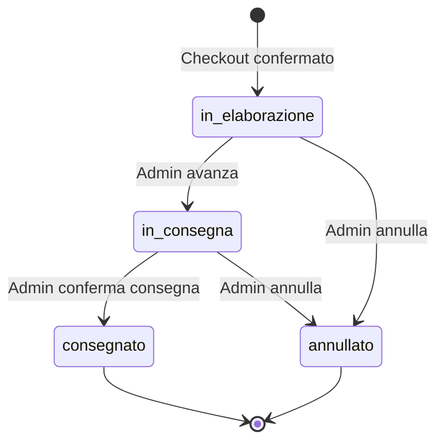
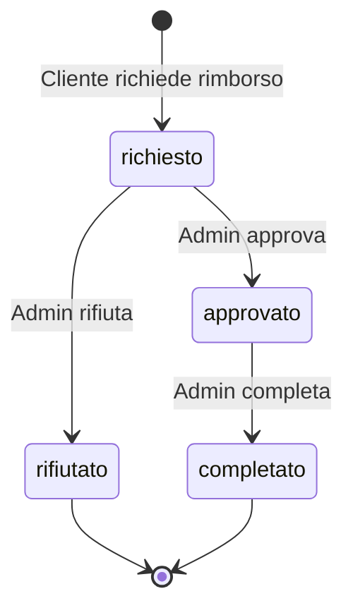

# FitTrend Store — Website Design Document (Parte Tecnica)

---

## 1. Architettura: MVC Model 2

L'applicazione adotta il pattern **MVC Model 2** (front-controller basato su Servlet), in cui ogni richiesta HTTP è gestita esclusivamente da una Servlet che funge da Controller, senza che il client possa mai accedere direttamente alle pagine JSP.

### Flusso di una richiesta tipica

```
Browser ──► Servlet (Controller)
               │
               ├── legge parametri, valida input
               ├── invoca DAO (Model) per accesso dati
               ├── imposta attributi su request/session
               │
               └──► forward a JSP (View)  oppure  redirect a un'altra Servlet
```

### Organizzazione dei package Java

| Package   | Responsabilità                                | Esempi di classi                                           |
|-----------|-----------------------------------------------|------------------------------------------------------------|
| `control` | Servlet: ricezione richieste, validazione, orchestrazione | `CarrelloServlet`, `CheckoutServlet`, `AdminProdottiServlet` |
| `model`   | JavaBean del dominio applicativo (POJO)       | `Prodotto`, `Ordine`, `DettaglioOrdine`, `Carrello`, `Rimborso` |
| `dao`     | Accesso ai dati tramite JDBC e DataSource JNDI | `ProdottoDAO`, `OrdineDAO`, `RimborsoDAO`, `DbManager`       |

### Organizzazione delle risorse web

| Percorso                | Contenuto                                      |
|-------------------------|-------------------------------------------------|
| `web/WEB-INF/view/`     | JSP (accessibili solo via forward da Servlet)   |
| `web/styles/`           | Fogli di stile CSS esterni                      |
| `web/scripts/`          | File JavaScript esterni                         |
| `web/images/products/`  | Immagini statiche dei prodotti                  |

Le JSP non contengono scriptlet (`<% %>`): tutti i dati dinamici sono resi tramite **Expression Language (EL)** e **JSTL** (`jakarta.tags.core`). CSS e JavaScript non sono mai inline.

---

## 2. Diagramma Entità-Relazione (ER)

```mermaid
erDiagram
    Utente {
        INT id PK
        VARCHAR nome
        VARCHAR cognome
        VARCHAR email UK
        VARCHAR password_hash
        TINYINT is_admin
    }

    Categoria {
        INT id PK
        VARCHAR nome UK
        VARCHAR descrizione
    }

    Prodotto {
        INT id PK
        VARCHAR nome
        TEXT descrizione
        NUMERIC prezzo
        INT categoria_id FK
        VARCHAR immagine
        INT quantita_disponibile
        TINYINT is_deleted
    }

    Ordine {
        INT id PK
        INT utente_id FK
        TIMESTAMP data_ordine
        NUMERIC totale
        TEXT indirizzo_spedizione
        VARCHAR citta_spedizione
        VARCHAR cap_spedizione
        VARCHAR metodo_pagamento
        VARCHAR ultime_cifre_carta
        VARCHAR stato
    }

    Dettaglio_Ordine {
        INT id PK
        INT ordine_id FK
        INT prodotto_id FK
        VARCHAR nome_prodotto_acquisto
        INT quantita
        NUMERIC prezzo_acquisto
    }

    Rimborso {
        INT id PK
        INT ordine_id FK_UK
        TIMESTAMP data_richiesta
        TIMESTAMP data_elaborazione
        NUMERIC importo
        TEXT motivo
        VARCHAR stato
    }

    Utente ||--o{ Ordine : "1 — N"
    Categoria ||--o{ Prodotto : "1 — N"
    Ordine ||--o{ Dettaglio_Ordine : "1 — N"
    Prodotto ||--o{ Dettaglio_Ordine : "1 — N"
    Ordine ||--o| Rimborso : "1 — 0..1"
```

### Cardinalità delle relazioni

| Relazione                          | Cardinalità | Note                                                            |
|------------------------------------|-------------|-----------------------------------------------------------------|
| Utente → Ordine                    | 1 — N       | Un utente può effettuare molti ordini                           |
| Categoria → Prodotto               | 1 — N       | Ogni prodotto appartiene a una sola categoria                   |
| Ordine → Dettaglio_Ordine          | 1 — N       | Ogni ordine contiene almeno una riga di dettaglio               |
| Prodotto → Dettaglio_Ordine        | 1 — N       | Uno stesso prodotto può comparire in più ordini                 |
| Ordine → Rimborso                  | 1 — 0..1    | Ogni ordine può avere al massimo un rimborso (UNIQUE su ordine_id) |

---

## 3. Soft-delete dei prodotti e dati storici nel dettaglio

### Soft-delete

I prodotti non vengono mai eliminati fisicamente dal database. L'eliminazione è **logica**: il campo `is_deleted` viene impostato a `1`. Questo preserva l'integrità referenziale con gli ordini già effettuati.

- Le query rivolte al **cliente** filtrano sempre per `WHERE is_deleted = 0`.
- Le query rivolte all'**amministratore** (`doRetrieveAllForAdmin`) non applicano questo filtro, mostrando tutti i prodotti con un badge di stato ("Attivo" / "Eliminato").

### Dati storici de-normalizzati

La tabella `Dettaglio_Ordine` contiene due campi de-normalizzati intenzionalmente:

- **`nome_prodotto_acquisto`**: fotografa il nome del prodotto al momento dell'acquisto.
- **`prezzo_acquisto`**: fotografa il prezzo unitario al momento dell'acquisto.

Questo garantisce la **correttezza storica**: se il nome o il prezzo di un prodotto vengono modificati in futuro, gli ordini passati continuano a mostrare i valori originali. La FK verso `Prodotto` è mantenuta per consentire la navigazione al prodotto corrente (es. "acquista di nuovo").

---

## 4. Ciclo di stato dell'ordine

Lo stato dell'ordine modella il suo ciclo di vita tramite una macchina a stati finiti:



| Stato              | Transizioni ammesse              | Effetti collaterali               |
|--------------------|----------------------------------|-----------------------------------|
| `in_elaborazione`  | → `in_consegna`, → `annullato`   | —                                 |
| `in_consegna`      | → `consegnato`, → `annullato`    | —                                 |
| `consegnato`       | (stato terminale)                | Abilita richiesta rimborso        |
| `annullato`        | (stato terminale)                | **Ripristino stock** in transazione |

I valori di stato sono definiti come costanti nella classe `Ordine` (es. `Ordine.STATO_IN_ELABORAZIONE = "in_elaborazione"`) e mappati ai valori stringa minuscoli del vincolo `CHECK` nel database. Le transizioni ammesse sono codificate in una mappa immutabile `Ordine.TRANSIZIONI_AMMESSE`, consultata dal DAO prima di ogni aggiornamento.

---

## 5. Ciclo di stato del rimborso



| Stato        | Transizioni ammesse           | Note                                             |
|--------------|-------------------------------|--------------------------------------------------|
| `richiesto`  | → `approvato`, → `rifiutato`  | `data_elaborazione` è NULL                       |
| `approvato`  | → `completato`                | `data_elaborazione` impostata a `NOW()`          |
| `rifiutato`  | (stato terminale)             | `data_elaborazione` impostata a `NOW()`          |
| `completato` | (stato terminale)             | —                                                |

### Precondizioni per la richiesta di rimborso (validate dal backend)

1. L'ordine deve essere in stato `consegnato` o `annullato`.
2. L'ordine deve appartenere all'utente che effettua la richiesta.
3. Non deve già esistere un rimborso per lo stesso ordine (vincolo UNIQUE su `ordine_id`).
4. L'importo del rimborso è preso dal campo `totale` dell'ordine nel DB, mai da un valore inviato dal client.

---

## 6. DataSource JNDI e transazioni JDBC

### Configurazione del DataSource

Le connessioni al database MySQL sono gestite tramite un **pool di connessioni JNDI**, configurato nel file `META-INF/context.xml` di Tomcat con il nome logico `jdbc/FitTrendDB`. La classe `DbManager` centralizza il lookup:

```java
Context envCtx = (Context) new InitialContext().lookup("java:comp/env");
DataSource ds = (DataSource) envCtx.lookup("jdbc/FitTrendDB");
```

Nessun DAO o Servlet crea connessioni direttamente: tutte passano per `DbManager.getConnection()`.

### Gestione delle transazioni

Le operazioni che coinvolgono più statement SQL correlati (salvataggio ordine, annullamento con ripristino stock, richiesta rimborso, aggiornamento stato) utilizzano **transazioni JDBC esplicite**:

```java
Connection con = DbManager.getConnection();
con.setAutoCommit(false);
try {
    // ... operazioni multiple ...
    con.commit();
} catch (SQLException e) {
    con.rollback();
    throw e;
} finally {
    con.setAutoCommit(true);
    con.close();
}
```

Tutte le connessioni, i `PreparedStatement` e i `ResultSet` sono chiusi tramite **try-with-resources**, prevenendo resource leak.

---

## 7. Lock stock, rollback e ripristino su annullamento

### Lock pessimistico durante il checkout

Il metodo `OrdineDAO.salvaOrdine()` esegue in un'unica transazione:

1. **`SELECT ... FOR UPDATE`** su ogni prodotto nel carrello → acquisisce un lock esclusivo a livello di riga, impedendo modifiche concorrenti allo stock.
2. **Verifica stock**: se `quantita_disponibile < quantita_richiesta`, esegue rollback e lancia eccezione con messaggio leggibile.
3. **Ricalcolo totale**: il prezzo viene riletto dal DB, ignorando qualsiasi valore proveniente dalla sessione del client.
4. **INSERT** dell'ordine con stato `in_elaborazione`.
5. **INSERT** delle righe di dettaglio con prezzi storici.
6. **Decremento stock** per ogni prodotto.
7. **Commit** atomico — tutte le operazioni riescono o nessuna viene applicata.

Il carrello in sessione viene svuotato **solo dopo** il commit confermato.

### Ripristino stock su annullamento

Quando un ordine passa allo stato `annullato`, il metodo `OrdineDAO.doUpdateStato()`:

1. Acquisisce un lock sulla riga dell'ordine (`SELECT stato ... FOR UPDATE`).
2. Verifica che la transizione sia ammessa consultando `Ordine.TRANSIZIONI_AMMESSE`.
3. Legge tutte le righe di `Dettaglio_Ordine` per quell'ordine.
4. Incrementa `quantita_disponibile` per ogni prodotto coinvolto.
5. Aggiorna lo stato dell'ordine.
6. Committa l'intera operazione in modo atomico.

Il ripristino avviene **nella stessa transazione** dell'aggiornamento di stato, garantendo che non ci sia un momento in cui lo stato è `annullato` ma lo stock non è ancora stato ripristinato.

---

## 8. Regole applicative non esprimibili nel database

Alcune regole di business non possono essere implementate tramite vincoli SQL (`CHECK`, `FK`, `UNIQUE`) e sono quindi validate esclusivamente nel layer Java (Servlet e DAO):

| Regola | Dove è validata |
|--------|-----------------|
| Un rimborso può essere richiesto solo per ordini in stato `consegnato` o `annullato` | `RimborsoDAO.richiediRimborso()` |
| L'utente che richiede il rimborso deve essere il proprietario dell'ordine | `RimborsoDAO.richiediRimborso()` |
| Le transizioni di stato dell'ordine seguono un grafo predefinito | `OrdineDAO.doUpdateStato()` via `Ordine.TRANSIZIONI_AMMESSE` |
| Le transizioni di stato del rimborso seguono un grafo predefinito | `RimborsoDAO.aggiornaStato()` con switch esplicito |
| La quantità nel carrello non può superare `quantita_disponibile` | `CarrelloServlet` (azione `aggiungi` e `modifica`) |
| Lo stock deve essere sufficiente al momento del checkout | `OrdineDAO.salvaOrdine()` con `SELECT ... FOR UPDATE` |
| Il prezzo dell'ordine è ricalcolato dal DB, non dal client | `OrdineDAO.salvaOrdine()` |
| L'importo del rimborso è preso dal totale dell'ordine nel DB | `RimborsoDAO.richiediRimborso()` |
| Il numero completo della carta non viene mai persistito | `CheckoutServlet` (salva solo ultime 4 cifre) |
| Solo gli admin possono accedere alle funzioni di gestione | `AuthHelper.isAdmin()` in ogni Servlet admin |
| Il parametro `ORDER BY` è protetto da whitelist | `ProdottoDAO.safeOrder()` |
| I metodi di pagamento accettati sono limitati a una whitelist | `CheckoutServlet.valida()` |

---

## 9. Gestione delle immagini

Le immagini dei prodotti sono memorizzate nel database come **path relativo completo** rispetto alla root dell'applicazione web, ad esempio:

```
images/products/tappetino-yoga.jpg
```

Nelle JSP, il percorso viene composto concatenando il context path dell'applicazione:

```jsp

```

Questo produce un URL assoluto corretto (es. `/FitTrend-Store/images/products/tappetino-yoga.jpg`) senza duplicare il prefisso `images/`. L'amministratore inserisce il path completo nel form di gestione prodotti; la `CarrelloServlet` copia il valore di `Prodotto.getImmagine()` nell'`ItemCarrello` senza alcuna trasformazione.

---

## 10. Sicurezza e validazione

### Prevenzione SQL Injection
Tutte le query utilizzano **PreparedStatement** con parametri posizionali (`?`). L'unico punto di concatenazione SQL è l'`ORDER BY`, protetto dalla whitelist `safeOrder()` che mappa l'input utente su colonne fisse predefinite.

### Prevenzione XSS
I dati dinamici nelle JSP sono stampati tramite `<c:out value="..." />`, che esegue l'escape automatico dei caratteri HTML.

### Validazione doppia
Ogni input è validato sia lato client (JavaScript) sia lato server (Servlet). La validazione JavaScript è una comodità per l'utente; la validazione server-side è quella che fa fede e non può essere aggirata.

### Protezione delle risorse
Le JSP risiedono in `WEB-INF/view/` e non sono accessibili direttamente via URL. Le Servlet admin verificano il ruolo dell'utente tramite `AuthHelper.isAdmin()` prima di qualsiasi operazione.
