# Website Design Document - FitTrend Store

**Corso di Laurea in Informatica**
**Tecnologie Software per il Web**

---

## 1. Obiettivo del progetto
Il progetto "FitTrend Store" consiste nello sviluppo di un sito di e-commerce dedicato alla vendita online di attrezzature per il fitness, abbigliamento sportivo e accessori per l'allenamento (es. manubri, tappetini, shaker). L'obiettivo è fornire agli appassionati di sport e home-fitness una piattaforma sicura, reattiva e intuitiva per effettuare i propri acquisti. Il sistema garantisce una distinzione chiara tra utenti standard (guest/clienti) e amministratori, offrendo a ciascuno strumenti dedicati.

## 2. Analisi dei competitor
Un'analisi preliminare di alcuni leader del settore (come *Decathlon* o *MyProtein*) ha evidenziato interfacce spesso cariche di pop-up promozionali o cataloghi dispersivi. **FitTrend Store** mira a differenziarsi puntando su un design minimale, "clean" e privo di distrazioni. Il percorso critico dell'utente (dalla ricerca nel catalogo, all'aggiunta al carrello, fino al checkout) è stato ottimizzato per richiedere il minor numero possibile di click, con validazioni in tempo reale per assistere l'utente durante la compilazione dei form.

## 3. Funzionalità del sito

### Utente Non Registrato (Ospite)
* **Catalogo:** Visualizzazione dei prodotti disponibili.
* **Carrello:** Inserimento prodotti, variazione quantità e rimozione (gestito in sessione).
* **Autenticazione:** Registrazione di un nuovo account tramite form validato.

### Utente Registrato (Cliente)
* **Tutte le funzionalità dell'ospite**.
* **Autenticazione:** Login e Logout.
* **Acquisto:** Checkout del carrello (compilazione dati spedizione e pagamento) con consolidamento dell'ordine nel database.
* **Storico:** Visualizzazione dell'elenco degli ordini effettuati.
* **Resi:** Possibilità di richiedere un rimborso per ordini in stato "consegnato" o "annullato".

### Amministratore
* **Sicurezza:** Accesso esclusivo ad aree riservate tramite `AuthFilter`.
* **Gestione Catalogo:** Inserimento, modifica e cancellazione (soft-delete) dei prodotti.
* **Gestione Ordini:** Visualizzazione degli ordini filtrabili per data/cliente e avanzamento di stato (in elaborazione → in consegna → consegnato, o annullamento con ripristino stock).
* **Gestione Rimborsi:** Revisione delle richieste e aggiornamento stato (approvato/rifiutato).

## 4. Layout
Il layout adottato prevede:
* **Header:** Logo testuale a sinistra, menù di navigazione orizzontale a destra (dinamico in base al ruolo).
* **Main Area:** Contenitore centrato per i contenuti (griglie prodotti, form, tabelle dati).
* **Footer:** Semplice e informativo.

*(Nota per lo studente: Inserisci qui l'immagine dei tuoi sketch/wireframe)*

## 5. Tema
Il tema visivo riflette l'energia e il dinamismo del fitness. L'interfaccia utilizza linee pulite, ampi spazi bianchi (whitespace) per favorire la lettura e bordi arrotondati. Si adotta un font moderno e senza grazie (sans-serif) per conferire un aspetto professionale e contemporaneo.

*(Nota per lo studente: Inserisci qui eventuali screenshot o mock del tema)*

## 6. Palette dei colori
La palette cromatica utilizza colori che ispirano fiducia e azione:
* **Sfondo:** Bianco (#FFFFFF) e grigio chiarissimo (#F7FAFC)
* **Testi primari:** Grigio scuro/Nero (#2D3748)
* **Call to Action (Pulsanti):** Blu intenso (es. #3182CE)
* **Messaggi di Stato:** Verde per successo (#C6F6D5 / #22543D), Rosso per errori (#FED7D7 / #822727).

*(Nota per lo studente: Inserisci qui l'immagine dei blocchi colore presi da Adobe Color o simili)*

## 7. Diagramma navigazionale
*(Nota per lo studente: Inserisci qui l'immagine del diagramma navigazionale logico ad albero)*

## 8. Diagramma navigazionale con le Servlet

Il flusso MVC prevede che ogni richiesta passi per una Servlet nel package `control`, che a sua volta fa forward verso la JSP in `WEB-INF/view/`.

```mermaid
graph TD
    %% Guest/Client
    HomeServlet["/home (GET)"] --> home_jsp["view/home.jsp"]
    CatalogoServlet["/catalogo (GET)"] --> catalogo_jsp["view/catalogo.jsp"]
    CarrelloServlet["/carrello (GET/POST)"] --> carrello_jsp["view/carrello.jsp"]
    CheckoutServlet["/checkout (GET)"] --> checkout_jsp["view/checkout.jsp"]
    CheckoutServletPOST["/checkout (POST)"] --Success--> ordini_jsp["view/ordini.jsp"]
    LoginServlet["/login (GET/POST)"] --> login_jsp["view/login.jsp"]
    RegistrazioneServlet["/registrazione (GET/POST)"] --> reg_jsp["view/registrazione.jsp"]
    
    %% Admin
    AdminProdotti["/admin/prodotti (GET/POST)"] --> admin_prod_jsp["view/admin_catalogo.jsp"]
    AdminOrdini["/admin/ordini (GET/POST)"] --> admin_ordini_jsp["view/admin_ordini.jsp"]
    AdminRimborsi["/admin/rimborsi (GET/POST)"] --> admin_rimborsi_jsp["view/admin_rimborsi.jsp"]
```



## 9. Schema ER della base di dati

L'architettura dei dati (MySQL) garantisce la storicizzazione corretta dei prezzi al momento dell'acquisto (nella tabella `Dettaglio_Ordine`) e l'integrità referenziale in caso di cancellazione dei prodotti tramite un campo `is_deleted` (soft-delete).

```mermaid
erDiagram
    Utente {
        INT id PK
        VARCHAR nome
        VARCHAR cognome
        VARCHAR email UK
        VARCHAR password_hash
        TINYINT is_admin
    }

    Categoria {
        INT id PK
        VARCHAR nome UK
        VARCHAR descrizione
    }

    Prodotto {
        INT id PK
        VARCHAR nome
        TEXT descrizione
        NUMERIC prezzo
        INT categoria_id FK
        VARCHAR immagine
        INT quantita_disponibile
        TINYINT is_deleted
    }

    Ordine {
        INT id PK
        INT utente_id FK
        TIMESTAMP data_ordine
        NUMERIC totale
        TEXT indirizzo_spedizione
        VARCHAR citta_spedizione
        VARCHAR cap_spedizione
        VARCHAR metodo_pagamento
        VARCHAR ultime_cifre_carta
        VARCHAR stato
    }

    Dettaglio_Ordine {
        INT id PK
        INT ordine_id FK
        INT prodotto_id FK
        VARCHAR nome_prodotto_acquisto
        INT quantita
        NUMERIC prezzo_acquisto
    }

    Rimborso {
        INT id PK
        INT ordine_id FK_UK
        TIMESTAMP data_richiesta
        TIMESTAMP data_elaborazione
        NUMERIC importo
        TEXT motivo
        VARCHAR stato
    }

    Utente ||--o{ Ordine : "1 — N"
    Categoria ||--o{ Prodotto : "1 — N"
    Ordine ||--o{ Dettaglio_Ordine : "1 — N"
    Prodotto ||--o{ Dettaglio_Ordine : "1 — N"
    Ordine ||--o| Rimborso : "1 — 0..1"
```

## 10. Repository GitHub
Il controllo di versione è stato gestito tramite commit a grana fine su un repository Git, sincronizzato con GitHub.

**URL Repository:** *(Nota per lo studente: Inserisci qui l'URL pubblico di GitHub, es. https://github.com/Utente/FitTrend-Store)*
